Shiny LEGO: building customized exploratory dashboard with modular code
========================================================
author: Bo Wang
date: Sr. Analyst, Stats Programming, Biogen
autosize: true
css: style.css

 June 13, 2019 

Me %>%
========================================================

 

China %>%

Iowa (Maths/French/Linguistics) %>%

Rhode Island (Biostats ScM) %>%

Boston (since June 2019)

Still me
========================================================

- Swimming & all water-related activities
- Traveling: 27 states in the US, 14 countries and counting
- Old French movies, GBBO, Friends
- data scientists in R community&frasl;following on Twitter ≈ 95%

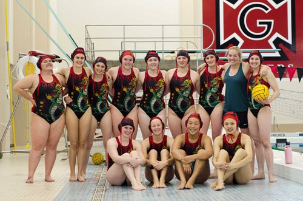

Things I will talk about
========================================================

- Motivating example: a story

- My solution to the problems
    + Shiny modules
    + code snippets
    + functions
    + Shiny/ggplot2 extension packages

- Demo (fingers crossed)
    + Biomarker data dashboard

- Lessons learned

Story time
========================================================

**SC** is a **medical director**. They have a very busy schedule but they think it's important to have first hand understanding of the **biomarker** data collected from ongoing trials, which could point to new research questions and even become evidence submitted to regulatory agencies. So they asked for tables and figures for every cohort/subgroup/pair of contrasts etc.

**GZ** is a **biostatistician**. At any given time, they work on at least 10 projects from 5 studies on 3 different compounds. They received the **ad hoc** table and figure requests, and did some (hopefully) **reproducible** exploratory analyses. Then they spent multiple hours on the phone/exchanged **50+ emails** with **SC**, trying to come up with clear, succint, non-ambiguous table/figure specifications.

Story time
========================================================

**EM** is a **programmer**. They received the specifications from GZ and everything looked fairly doable: **join** and **reshape** some datasets, create some **filters**, **scatter plots**, **spaghetti plots**, so they promised to get it done by the end of the week.

...

**EM** finished the requests on Friday and was ready for the weekend. Suddenly they got a ping from **GZ**, the biostatistician: "Can you make a small change to the scatter plot? Can you create plots for patients in group A who have type X and are at least 1 year, 6 month, and 3 months old when they started the trial?"

Story time
========================================================

**EM** finished the modified requests on Monday and sent the **128** plots to **GZ** and **SC** for review. Two weeks later, **SC**, the medical director, came back with **3** plots that turned out to be useful, and asked for changes in plot **titles**, **point sizes**, and **colors** for group B.

Repeat the above process for 2-5 times.

**Problem**: Functions with no programming background and/or other priorities need an easy way to explore data and reach a consensus of what table/figures should be produced and reduce back-and-forth communication.

Obvious solution
========================================================

**Shiny**: build interactive web application using R

- interactive, flexible, relatively easy to develop
- R packages, statistical methods, open data science community

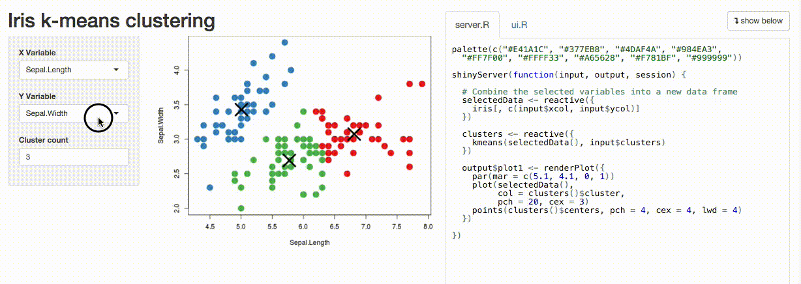

Not always easy...
========================================================

 

- Easy to start, challenging to reach advanced level

- Enthusiam from clients:
    + high expectation of flexibility and rapid turn-around

- Shiny programmer is a new role
    + CS, stats, business analytics, etc.

Shiny modules
========================================================

A Shiny module is a piece of a Shiny app. It can’t be directly run, as a Shiny app can. Instead, it is included as part of a larger app (or as part of a larger Shiny module–they are **composable**) ...

Once created, a Shiny module can be easily **reused** – whether across different apps, or multiple ... Modules can even be bundled into **R packages** and used by other Shiny authors. Other Shiny modules will be created that have no potential for reuse, by simply breaking up a complicated Shiny app into separate modules that can each be *reasoned about independently*.

-- Joe Cheng, author of Shiny package

Everything in modules?
========================================================

 

Not necessarilty. Suitable Shiny module features:

- Single/few input, single/few output

- Does not intertwine with base Shiny structure

- Single, confined purpose

What about packages/extentions from the community?
========================================================

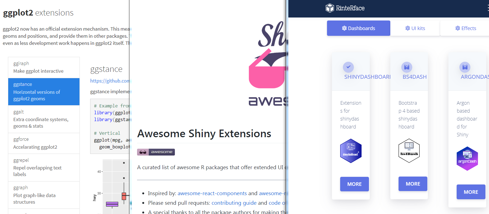

My solution: Shiny LEGO
========================================================
 
p(erfect) <-

**Shiny Modules** +

**code snippet** +

**R functions** +

**.rds** +

**package/extensions**

***

Module: mod_getData1.R
========================================================

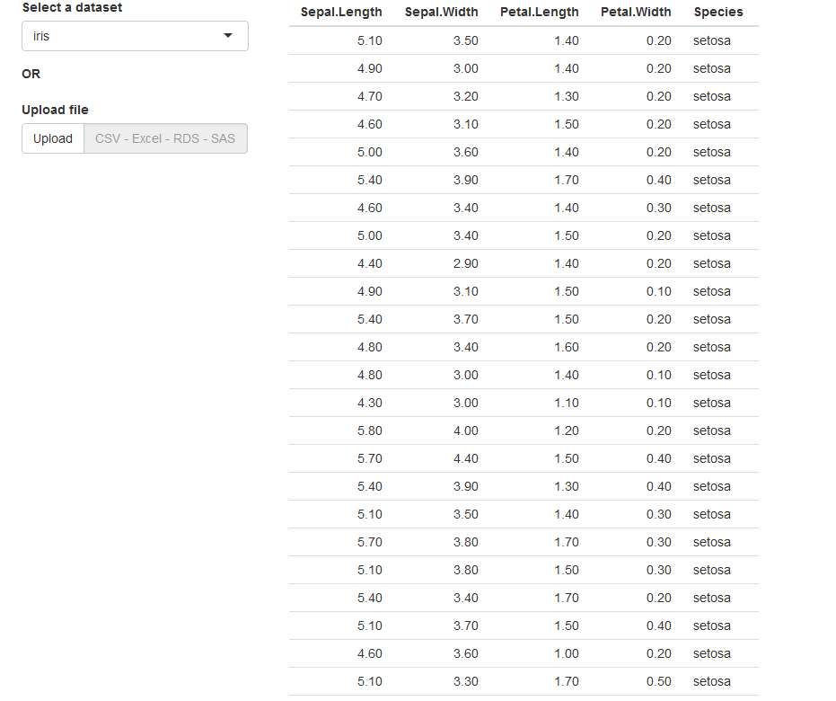

Module: mod_getData2.R
========================================================

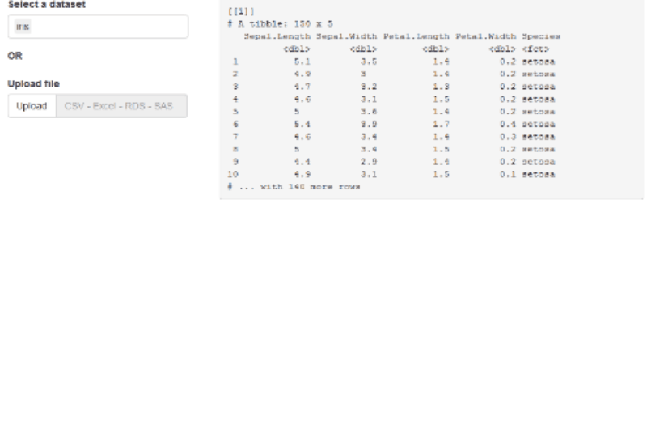

Module: mod_varInfo.R
========================================================

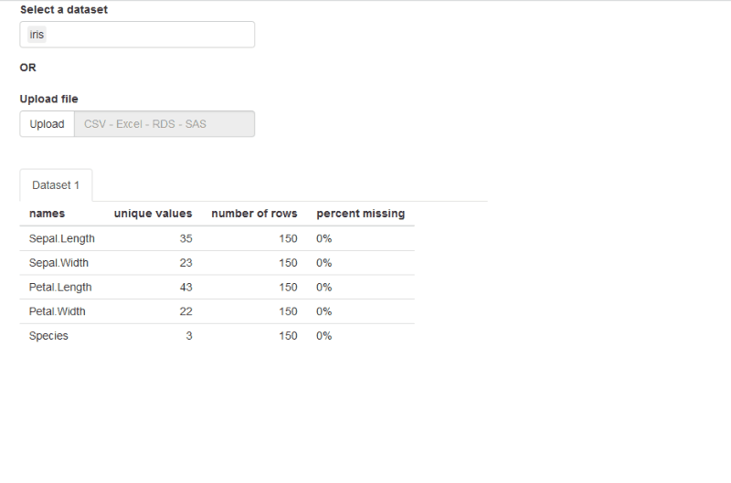

Code snippet: dynamicUIelements
========================================================

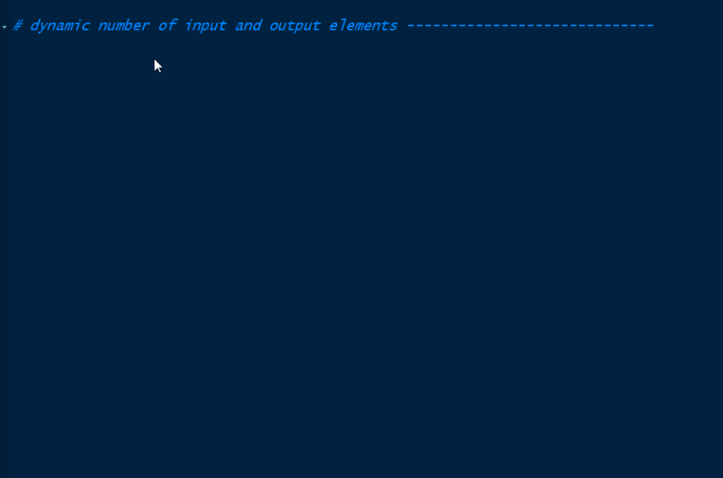

Module: mod_filterCat.R
========================================================

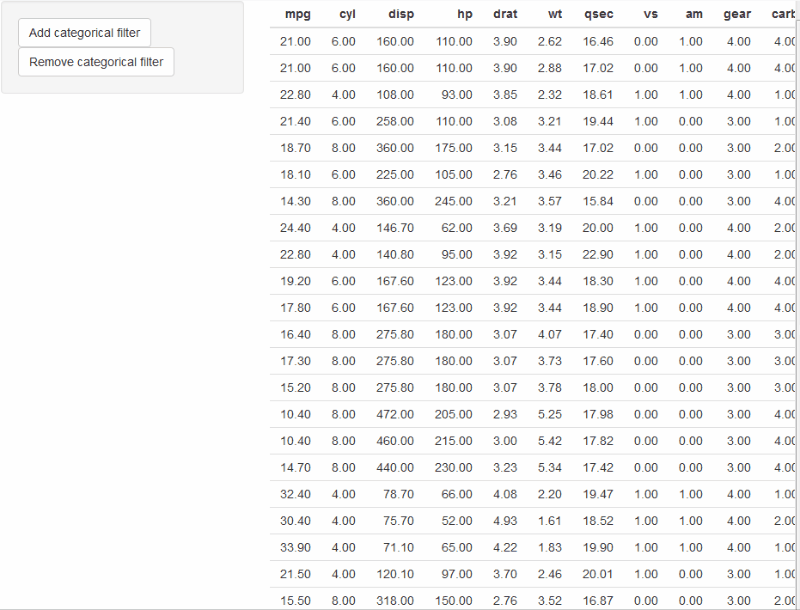

Module: mod_filterDog.R
========================================================

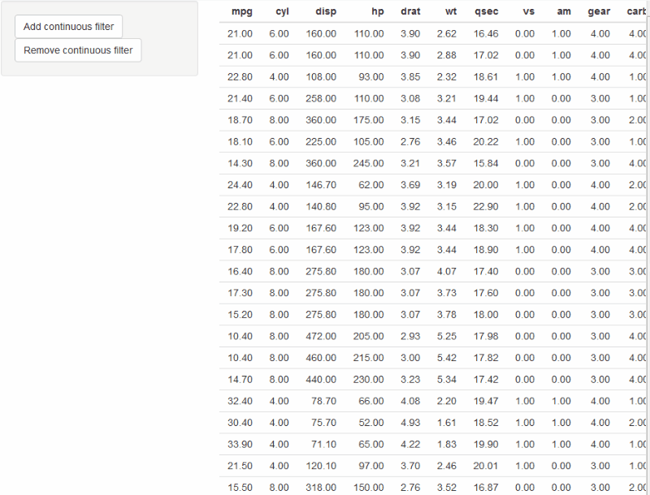

Module: Dog.R
========================================================

Module: mod_colorPicker.R
========================================================

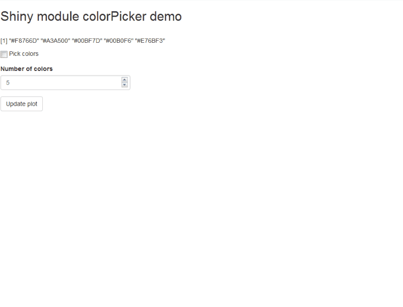

Module: mod_gear.R
========================================================

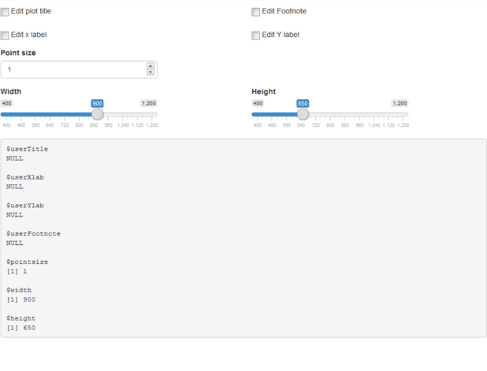

Sample data: biomarker
========================================================
 

- 2 studies: NARS - **N**ot **A** **R**eal **S**tudy, TFS - **T**otally **F**ake **S**tudy
- Longitudinal: baseline + 9 visits perpatient
- 2 biomarkers: PARAM = {bm1, bm2}
- 2 biological matrix: BIOMAT = {Plasma, CSF}
- 5 datasets:
    + nars201_bm1
    + nars201_bm2_csf
    + nars201_bm2_pl
    + tfs3b_bm1
    + tfs3b_bm2

Module: mod_spaghetti.R
========================================================

Module: mod_long2Wide.R
========================================================

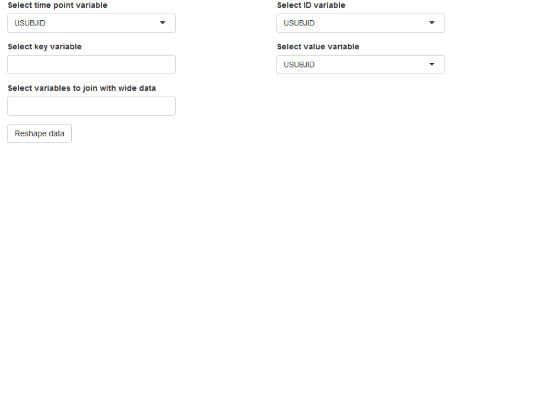

Module: mod_scatter.R
========================================================

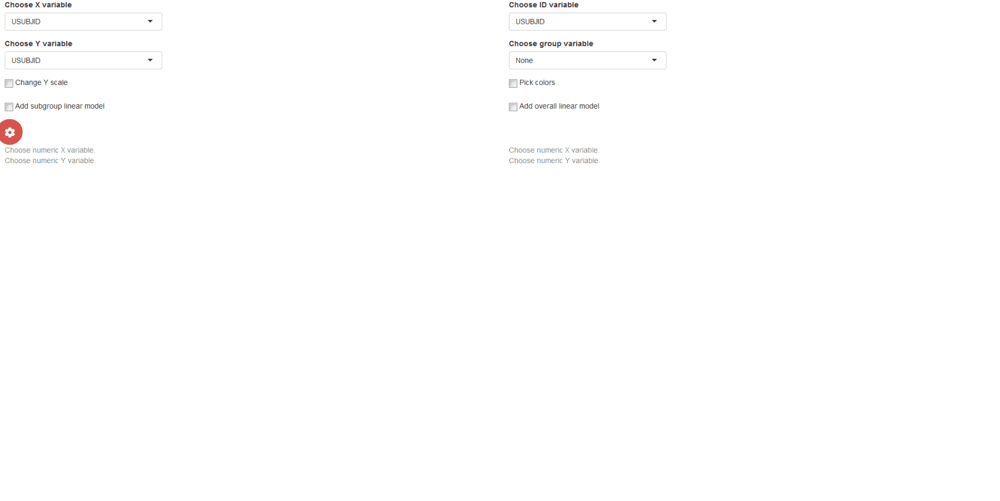

How can this model help programmer?
========================================================

 

- Inevitable small changes requested

- R script that does the same thing as the module, using `input` onject saved in .rds

Lessons and reflections
========================================================

 

- Not everything is Shiny-eligible (ANOVA multiple comparison)

- Have control of what is offered in Shiny

- Other tools are out there (rmd, tableau, excel, etc.)

Questions?
========================================================

